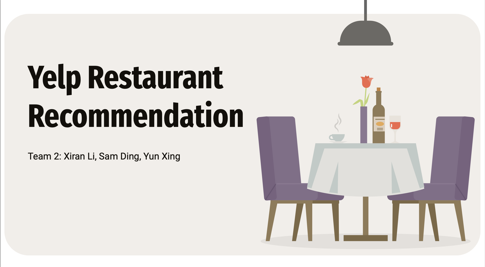

# Yelp Businesses 

This is a project affiliated with the University of Chicago's Applied Data Science Program. In this project, we:

- Aimed to enhance user experience through personalized recommendations and collaboration with restaurants on Yelp.
- Honed in our skills in enterprise-level tools like Google Cloud Platforms, AWS, and PySpark.
- Created a recommender system using collaborative filtering methods, as well as a sentiment analysis model tracking unlabeled short reviews

This is a project by Yun Xing ([yxing3@uchicago.edu](mailto:yxing3@uchicago.edu)), Xiran Li ([xiranli16@uchicago.edu](mailto:xiranli16@uchicago.edu)), and Sam Ding ([zding1@uchicago.edu](mailto:zding1@uchicago.edu)). 
Feel free to reach out to them if you have any questions about the project.
